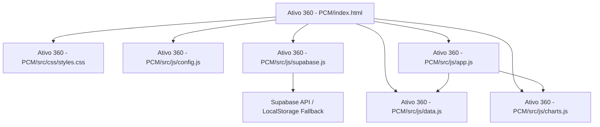

# Sistema de Controle de Estoque ATIVO360 (Estilo A-DELL SOLUTIONS / Fracttal One)

Este projeto consiste na criação de um **Sistema de Controle de Estoque e Almoxarifado** moderno, responsivo e de alta performance, inspirado na plataforma **Fracttal One** e personalizado com a identidade visual **ATIVO360** da **A-DELL SOLUTIONS**. O sistema será construído como uma Single Page Application (SPA) rica e interativa usando tecnologias web nativas (HTML5, CSS3, ES6 JavaScript) e integrado com bibliotecas de ponta (Chart.js para gráficos e Supabase para banco de dados e autenticação).

O sistema contará com persistência de dados em nuvem através do **Supabase** (PostgreSQL + Auth). Caso o Supabase não esteja configurado, o sistema oferecerá um modo de demonstração off-line (usando LocalStorage) para que a aplicação seja testada de imediato.

---

## User Review Required

> [!IMPORTANT]
> **Autenticação e Persistência Supabase:**
> 1. **Nova Tela de Login (Baseada na Referência):**
>    - Adicionaremos uma tela de login moderna com fundo degradê lilás/azul, contendo um card flutuante em glassmorphism (efeito vidro fosco) com a logo **A-DELL SOLUTIONS**, campos de e-mail/senha com opção de alternar visibilidade, botão de login laranja vibrante e ícones de provedores sociais (Google, GitHub, Facebook) conforme imagem de referência.
>    - Haverá alternância dinâmica entre as telas de **Entrar (Sign In)** e **Cadastrar-se (Sign Up)**.
> 2. **Configuração de Credenciais:**
>    - O sistema carregará a URL e a Chave Pública do Supabase a partir de um formulário de setup amigável (armazenado com segurança no navegador) ou via arquivo de configuração `src/js/config.js`.
> 3. **Script de Banco de Dados SQL:**
>    - Forneceremos um script SQL completo (`schema.sql`) para criação automática das tabelas de Peças, Almoxarifados, Fornecedores, Ativos, OS e Movimentações para ser colado diretamente no editor SQL do console do Supabase.

---

## Open Questions

> [!NOTE]
> Gostaríamos de sua opinião sobre:
> - RLS (Row Level Security): Deseja que a leitura das tabelas seja restrita apenas ao usuário autenticado que a criou, ou que todos os usuários autenticados compartilhem a mesma base da UO Ativo 360? *(Implementaremos o compartilhamento entre UO por padrão para simular o ambiente corporativo)*.

---

## Proposed Changes

O projeto será organizado de forma limpa e modular na pasta **Ativo 360 - PCM** dentro do seu workspace: `c:/Users/adeli/Documents/antigravity/Projetos/Ativo 360 - PCM`.

---

### 1. Interface Principal e Login

#### [MODIFY] [index.html](file:///c:/Users/adeli/Documents/antigravity/Projetos/Ativo%20360%20-%20PCM/index.html)
- Adição da estrutura da tela de Login (ocultando a tela interna do app até que a autenticação seja bem-sucedida).
- Carregamento da SDK do Supabase JS via CDN seguro (`https://cdn.jsdelivr.net/npm/@supabase/supabase-js@2`).
- Adição do modal de configuração do Supabase para entrada amigável de chaves de API.

#### [MODIFY] [styles.css](file:///c:/Users/adeli/Documents/antigravity/Projetos/Ativo%20360%20-%20PCM/src/css/styles.css)
- Estilização completa da página de login inspirada no layout de referência:
  - Fundo degradê pastel (`linear-gradient(135deg, #a7b5ff 0%, #d6dbff 100%)`).
  - Card de login translúcido (`rgba(255, 255, 255, 0.45)`) com desfoque de fundo intenso, borda branca translúcida e sombra projetada.
  - Campos de entrada e botão laranja (`#f3521e` ou `#FF3D00`).
  - Botão de logout estilizado no painel interno.

---

### 2. Integração de Dados com Supabase

#### [NEW] [config.js](file:///c:/Users/adeli/Documents/antigravity/Projetos/Ativo%20360%20-%20PCM/src/js/config.js)
- Definição das chaves do Supabase (`SUPABASE_URL` e `SUPABASE_KEY`).

#### [NEW] [supabase.js](file:///c:/Users/adeli/Documents/antigravity/Projetos/Ativo%20360%20-%20PCM/src/js/supabase.js)
- Inicialização do cliente Supabase.
- Funções wrapper para Login (`signIn`), Cadastro (`signUp`), Logout (`signOut`) e verificação de estado.
- Lógica de sincronização: funções que lêem e gravam das tabelas do Supabase, com fallback transparente para o arquivo `data.js` (LocalStorage) caso as chaves não estejam configuradas.

#### [NEW] [schema.sql](file:///c:/Users/adeli/Documents/antigravity/Projetos/Ativo%20360%20-%20PCM/schema.sql)
- Script DDL completo de banco de dados (tabelas, chaves primárias/estrangeiras e sementes de dados).

#### [MODIFY] [data.js](file:///c:/Users/adeli/Documents/antigravity/Projetos/Ativo%20360%20-%20PCM/src/js/data.js)
- Adaptação dos métodos de persistência para consultar o módulo `supabase.js` de forma assíncrona, mantendo compatibilidade com as telas de frontend.

#### [MODIFY] [app.js](file:///c:/Users/adeli/Documents/antigravity/Projetos/Ativo%20360%20-%20PCM/src/js/app.js)
- Adição dos escutadores de eventos para o fluxo de Login/Cadastro.
- Proteção de rotas: redirecionamento automático para a tela de login se não houver sessão ativa.
- Atualização assíncrona das exibições após login bem-sucedido.

---

## Verification Plan

### Manual Verification
1. **Fluxo de Login e Erros:**
   - Tentar entrar com dados incorretos e verificar a exibição de toasts de erro do Supabase.
   - Criar uma nova conta usando o fluxo "Registrar Grátis" e validar no painel do Supabase se o usuário foi registrado.
2. **Sincronização de Dados:**
   - Adicionar uma peça e validar se ela aparece imediatamente na tabela `parts` do Supabase.
   - Modificar dados offline (modo LocalStorage) e depois conectar o Supabase para certificar que o app se adapta à nuvem.
3. **Consumo de Estoque:**
   - Realizar saídas de estoque e validar no histórico se as movimentações estão sendo salvas no Supabase.

